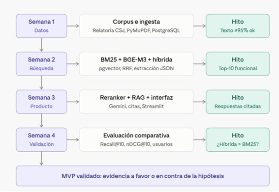

# ⚖️ Asistente de Búsqueda de Precedentes Penales con IA (MVP)

Repositorio oficial del equipo para el desarrollo del Mínimo Producto Viable (MVP) enfocado en la búsqueda y recomendación inteligente de jurisprudencia penal en Colombia.

---

## 📋 1. Descripción del Problema y Justificación
En el sistema penal colombiano, los jueces, fiscales y abogados penalistas enfrentan serias dificultades para identificar jurisprudencia comparable de manera eficiente. Las búsquedas tradicionales basadas únicamente en palabras clave suelen arrojar resultados imprecisos, y el creciente volumen de sentencias dificulta el análisis oportuno de los precedentes judiciales.

* **Objetivo del MVP:** Implementar una herramienta basada en Inteligencia Artificial (patrón RAG - Retrieval-Augmented Generation) para automatizar la identificación de casos penales similares, facilitando la consulta de decisiones adoptadas con citas verificadas y trazables.

*(Nota: La planeación estratégica, la formulación metodológica y los detalles técnicos completos se encuentran en el documento del proyecto subido a este repositorio).*

---

## 🎨 2. Prototipo de Media Fidelidad (Diseño de Interfaz)
El diseño visual, el flujo de usuario y la experiencia interactiva de la aplicación fueron prototipados en Canva, abarcando las siguientes vistas:
* Pantalla de bienvenida y registro de usuarios.
* Módulo de inicio de sesión seguro.
* Buscador principal con soporte para consultas en lenguaje natural.
* Menú de carga de archivos (PDF e imágenes) para el análisis de casos.

* 🔗 **Enlace al Prototipo interactivo en Canva:** [https://canva.link/ghldqcphs0v0ff2](https://canva.link/ghldqcphs0v0ff2)

---

## 📅 3. Cronograma, Fases e Hitos del Proyecto
El desarrollo metodológico del MVP está estructurado en cuatro semanas con sus respectivos hitos de validación técnica:

* **Semana 1 (Datos):** Corpus e ingesta (Relatoría de la Corte Suprema de Justicia, procesamiento con PyMuPDF y almacenamiento en PostgreSQL). 
  * *Hito:* Texto extraído con calidad >95% OK.
* **Semana 2 (Búsqueda):** Indexación y recuperación híbrida (BM25 + BGE-M3 utilizando `pgvector`, fusión RRF y extracción estructurada en JSON).
  * *Hito:* Top-10 de documentos funcionales y relevantes.
* **Semana 3 (Producto):** Implementación de Reranker, integración del modelo RAG con la API de Gemini y desarrollo de la interfaz de usuario en Streamlit.
  * *Hito:* Generación de respuestas con citas y referencias precisas.
* **Semana 4 (Validación):** Evaluación comparativa del sistema (métricas de recuperación Recall@10, nDCG@10 y pruebas con usuarios).
  * *Hito:* Validación de la hipótesis (¿Búsqueda híbrida superior a BM25 tradicional?).

---

## ⚙️ 4. Consideraciones Técnicas y Límites del MVP
* **Uso de la API de Gemini:** El plan gratuito de Gemini puede utilizar los datos enviados para mejorar sus productos. Por seguridad y privacidad, para las pruebas del MVP se recomienda utilizar exclusivamente casos ficticios, anonimizados o modelos locales mediante Ollama.
* **Rendimiento de Modelos Locales:** Los modelos ejecutados localmente mediante Ollama (7-8B) presentan limitaciones en la lectura de sentencias extensas, por lo que se mantienen como respaldo frente a la API principal.
